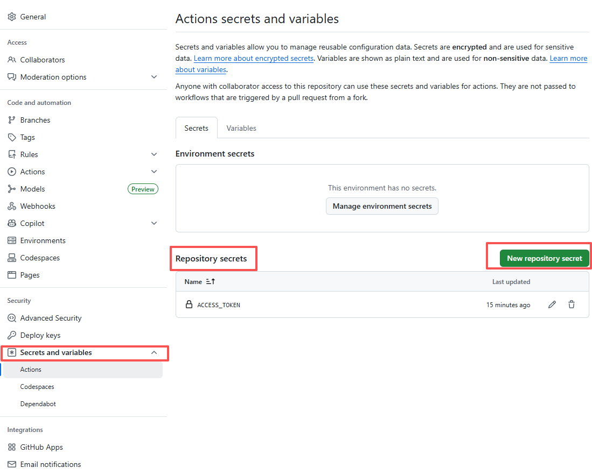
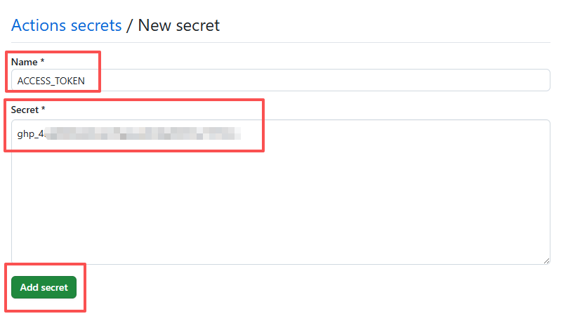

# GitHub Pages 部署 Vitepress 时常见问题

## 当前仓库添加 ACCESS_TOKEN

::: tip
可以解决 GitHub workflow 时的权限问题
:::

### 1. 生成 PAT

官网教程：[GitHub Personal Access Token (PAT/个人访问令牌) 生成步骤](https://docs.github.com/cn/enterprise-server@2.20/github/authenticating-to-github/creating-a-personal-access-token)

### 2. GitHub Pages 设置

- 进入仓库，点击 **Settings**

- 侧边栏点击：Secrets and variables，选择 **Actions**

如图：

找到 **Repository secrets** 项，点击绿色的 [**New repository secret**]

- 如图：

- Name 选择 **ACCESS_TOKEN**

- Secret 填写上面生成的 PAT 密钥

- 然后点击 [**Add secret**] 即可。

### 3. 测试

最后去 Actions 手动运行一次 [**Run workflow**] 测试是否成功。
